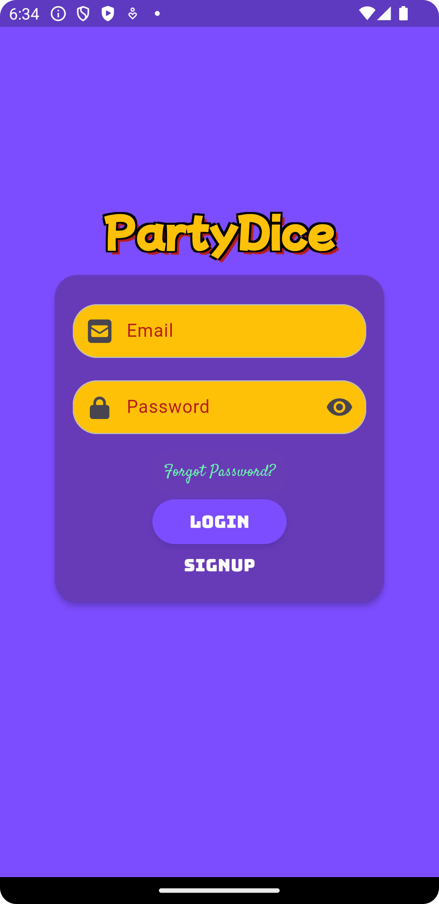
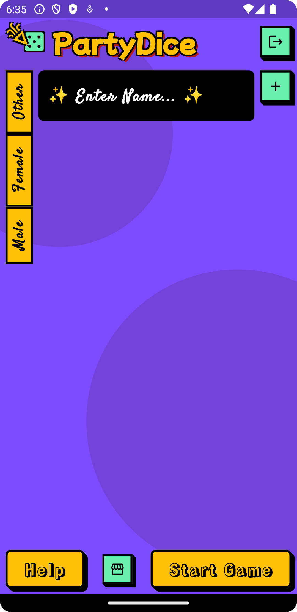
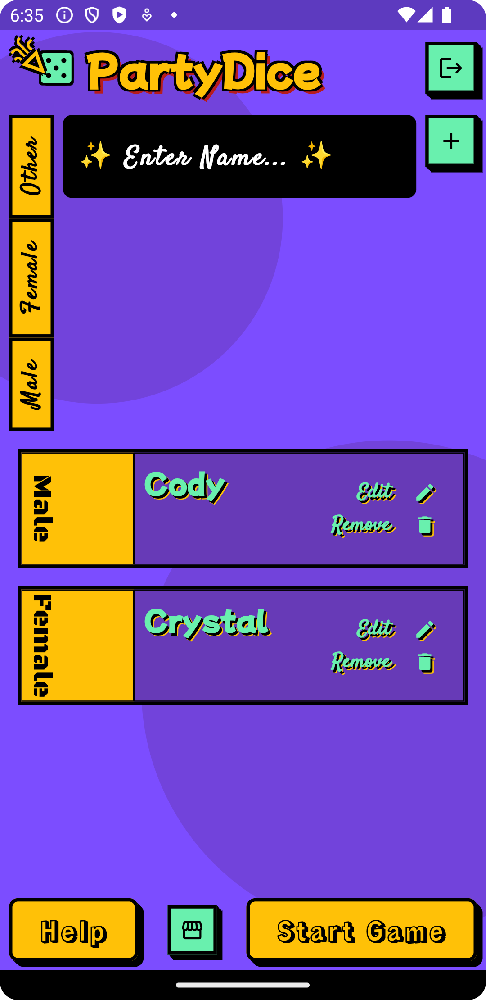
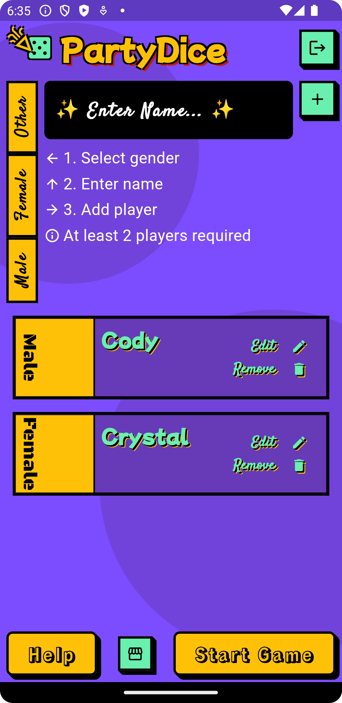
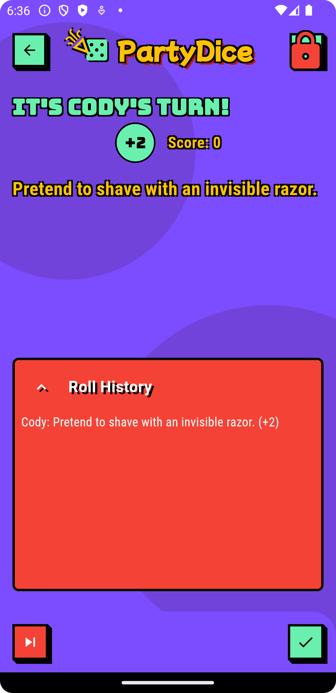
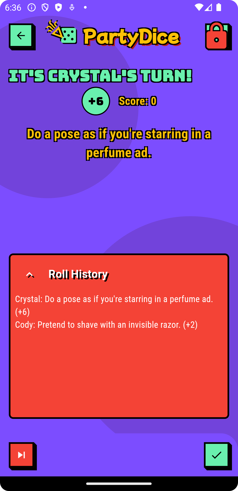

# PartyDice 🎲

PartyDice is a fun and interactive game designed for parties and group activities. Built with Flutter, this app provides exciting gameplay, engaging animations, and a store to enhance your experience.

## Screenshots 📸

1. **Login Screen**  
     
   The login screen allows users to sign in or create an account to save their game progress.

2. **PartyDice Screen**  
     
   The main screen where users set up players and prepare for gameplay.

3. **Player Setup**  
     
   Add players by selecting a gender, entering a name, and preparing the player list.

4. **Help Screen**  
     
   Displays instructions and requirements for playing the game.

5. **Gameplay Screen (Player 1)**  
     
   Shows Player 1's turn, the task assigned by the dice, and the current score.

6. **Gameplay Screen (Player 2)**  
     
   Shows Player 2's turn, their assigned task, and updated roll history.

## Features ✨

- **User Authentication**: Login and signup features to create and save player profiles.
- **Customizable Gameplay**: Players can add, edit, and remove their profiles before starting a game.
- **Turn-based Fun**: Each player takes turns performing tasks or challenges assigned by the dice rolls.
- **Roll History**: Keeps track of the tasks and challenges completed during gameplay.
- **In-App Store**: Purchase additional features or themes to enhance the game (not shown in screenshots).
- **Dynamic Animations**: Engaging animations for smooth transitions between screens and actions.

## File Structure 📂

```plaintext
lib/
├── firebase_options.dart         # Firebase configuration options
├── main.dart                     # Application entry point
├── models/
│   └── player.dart               # Player data model
├── screens/
│   ├── gameplay_screen.dart      # Core gameplay functionality
│   ├── login_screen.dart         # User login interface
│   ├── party_dice_screen.dart    # Player setup and gameplay preparation
│   └── store_screen.dart         # In-app store interface
├── widgets/
│   ├── animated_button.dart      # Custom animated button widget
│   ├── gender_selection.dart     # Gender selection widget
│   └── player_card.dart          # Player card widget
```

## How to Play 🎮

1. **Login/Sign Up**: Create or log in to your account.
2. **Add Players**: Select a gender, enter a name, and add at least two players to start the game.
3. **Start Game**: Begin the gameplay and follow the instructions for your turn.
4. **Track Progress**: View the roll history to see completed challenges.
5. **Explore the Store**: Enhance your experience by purchasing additional features.

## Getting Started 🚀

### Prerequisites

- Install [Flutter](https://flutter.dev/docs/get-started/install) on your system.

### Installation

1. Clone the repository:
   ```bash
   git clone https://github.com/cod-e-codes/PartyDice.git
   ```

2. Navigate to the project directory:
   ```bash
   cd PartyDice
   ```

3. Install dependencies:
   ```bash
   flutter pub get
   ```

4. Run the app:
   ```bash
   flutter run
   ```

### Firebase Setup

Ensure to configure Firebase in your project using the provided `firebase_options.dart` file.

## Author 🖊️

This app was developed by **CodēCodes**. Check out more of my projects on [GitHub](https://github.com/cod-e-codes).

---

Have fun and enjoy the PartyDice experience!
